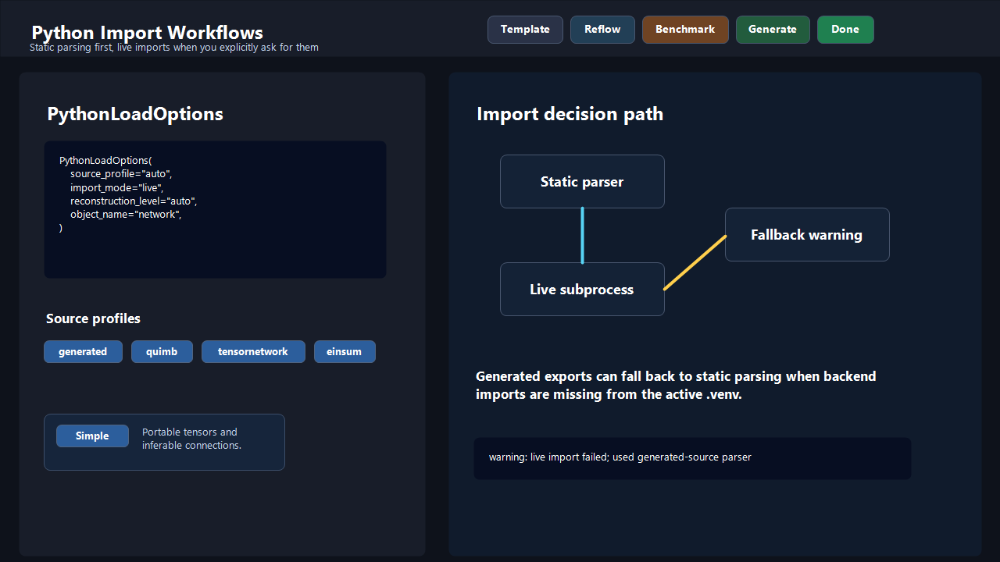

# Python API

This page describes the public Python API you are most likely to use. For the
data model fields themselves, see [data-models.md](data-models.md).

## Contents

- [Main Imports](#main-imports)
- [Launch the Editor](#launch-the-editor)
- [Generate Code](#generate-code)
- [Render SVG](#render-svg)
- [Save and Load Designs](#save-and-load-designs)
- [Validate, Lint, Analyze, Canonicalize, and Diff](#validate-lint-analyze-canonicalize-and-diff)
- [Templates](#templates)
- [Subnetwork Helpers](#subnetwork-helpers)
- [Extension Hooks](#extension-hooks)
- [Errors](#errors)
- [Small Complete Example](#small-complete-example)

## Main Imports

The package exposes the main functions and models at the top level:

```python
from tensor_network_editor import (
    EngineName,
    NetworkSpec,
    PythonLoadOptions,
    TensorDataMode,
    TensorDataSpec,
    SvgRenderOptions,
    TensorCollectionFormat,
    ValidationIssue,
    analyze_contraction,
    analyze_spec,
    build_template_spec,
    canonicalize_spec,
    diff_specs,
    generate_code,
    lint_spec,
    list_template_names,
    load_python_spec,
    load_spec,
    open_editor,
    render_spec_png,
    render_spec_svg,
    save_spec,
    semantic_diff_specs,
    validate_spec,
)
```

Most workflows only need a few of these imports.

The documented imports above are the stable guided public surface. Explicit
public modules such as `tensor_network_editor.editor`,
`tensor_network_editor.io`, `tensor_network_editor.models`, and
`tensor_network_editor.templates` stay available when you want more structure
or advanced hooks.

Useful public modules:

| Module | Use it for |
| --- | --- |
| `tensor_network_editor.editor` | `EditorLaunchOptions` and `open_editor(...)` |
| `tensor_network_editor.io` | JSON/Python loading, saving, `serialize_spec(...)`, and `SCHEMA_VERSION` |
| `tensor_network_editor.models` | data classes, result models, enums, and periodic-mode types |
| `tensor_network_editor.rendering` | pure-Python SVG rendering helpers |
| `tensor_network_editor.validation` | hard validation helpers |
| `tensor_network_editor.linting` | soft modeling diagnostics |
| `tensor_network_editor.analysis` | structural and contraction analysis |
| `tensor_network_editor.canonicalization` | stable ordering and optional deterministic ids |
| `tensor_network_editor.templates` | built-in templates and template registration |
| `tensor_network_editor.subnetworks` | extraction and insertion preparation for reusable fragments |
| `tensor_network_editor.codegen.registry` | advanced backend-generator registration |

Modules under `tensor_network_editor.internal` are implementation details. They
are used by the package itself and by tests, but they are not a stable
user-facing API.

## Launch the Editor

Use `open_editor(...)` when you want a local browser editing session from
Python.

```python
from tensor_network_editor import EngineName
from tensor_network_editor.editor import EditorLaunchOptions, open_editor


def main() -> None:
    result = open_editor(
        options=EditorLaunchOptions(
            default_engine=EngineName.EINSUM_NUMPY,
            open_browser=True,
        ),
    )

    if result is None:
        print("Editor cancelled.")
        return

    print(result.engine.value)
    print(result.spec.name)
    if result.codegen is not None:
        print(result.codegen.code)
```

Main parameters:

- `spec`: preload an existing `NetworkSpec`
- `options.default_engine`: initial target backend shown in the editor
- `options.default_collection_format`: initial tensor collection layout
- `options.open_browser`: open the browser automatically
- `options.host`: local host address, default `127.0.0.1`
- `options.port`: local port, default `0` so the OS chooses one
- `options.print_code`: print generated code after confirmation
- `options.code_path`: write generated code after confirmation
- `options.template_catalog_path`: optional per-project static template catalog path
- `options.subnetwork_catalog_path`: optional per-project reusable-subnetwork catalog
  path
- `options.shared_subnetwork_catalog_path`: optional shared reusable-subnetwork
  catalog path merged with the project catalog at runtime

Return value:

- `None` when the user cancels
- `EditorResult` when the user confirms

`EditorResult` contains `spec`, `engine`, `codegen`, and `confirmed`.

Practical note:

- if project and shared reusable-subnetwork catalogs define the same entry
  name, the project entry shadows the shared one

## Generate Code

Use `generate_code(...)` when you already have a `NetworkSpec`.

```python
from tensor_network_editor import (
    EngineName,
    TensorCollectionFormat,
    generate_code,
    load_spec,
)


spec = load_spec("my_network.json")
result = generate_code(
    spec,
    engine=EngineName.QUIMB,
    collection_format=TensorCollectionFormat.DICT,
    output_path="generated_network.py",
)

print(result.engine.value)
print(result.code)
print(result.warnings)
```

Useful behavior:

- `print_code=True` prints the generated source
- `output_path="..."` writes the generated source to a file
- `external_data_base_path="..."` anchors relative `.npy` / `.npz` tensor-data
  paths before writing generated code; without it, the stored path text is used
  as-is
- `collection_format` can be `LIST`, `MATRIX`, or `DICT`
- a backend-specific export problem raises `CodeGenerationError` from
  `tensor_network_editor.errors`

If a saved `contraction_plan` exists, generated code follows that manual plan.
Complete plans emit a final `result`. Partial plans emit intermediate values
and a `remaining_operands` mapping.

## Render Static Figures

Use `render_spec_svg(...)` or `render_spec_png(...)` when you want a static
figure without opening the browser editor.

```python
from tensor_network_editor import (
    SvgRenderOptions,
    load_spec,
    render_spec_png,
    render_spec_svg,
)


spec = load_spec("my_network.json")
svg = render_spec_svg(
    spec,
    options=SvgRenderOptions(padding=48.0),
    output_path="figure.svg",
)
png = render_spec_png(spec, output_path="figure.png")
print(svg[:80])
```

The SVG renderer is pure Python and has no browser/Node dependency. PNG export
uses the same saved canvas positions and requires the optional `png` extra
(`Pillow`). Both renderers validate the spec and draw tensors, indices,
pairwise edges, hyperedges, groups, and notes.

## Save and Load Designs

Use `save_spec(...)` and `load_spec(...)` for the abstract JSON design.

```python
from tensor_network_editor import load_spec, save_spec


spec = load_spec("my_network.json")
save_spec(spec, path="copy_of_my_network.json")
```

Important details:

- `save_spec(...)` validates before writing
- `load_spec(...)` accepts saved JSON designs
- `load_spec(...)` also accepts supported `.py` sources and autodetects one of
  the built-in Python import profiles: `generated`, `quimb`,
  `tensornetwork`, or `einsum`
- `load_python_spec(...)` works when source is already in memory
- both functions accept `python=PythonLoadOptions(...)` when you want to lock
  the parser or import behavior explicitly
- `PythonLoadOptions.source_profile` defaults to `auto`, or accepts
  `generated`, `quimb`, `tensornetwork`, or `einsum` when you want to pin the
  parser explicitly
- `PythonLoadOptions.import_mode="live"` executes the source in a subprocess using the
  active Python interpreter, supports live `quimb` and `tensornetwork`
  objects, and accepts `object_name="..."` when several compatible
  globals exist
- `PythonLoadOptions.reconstruction_level="simple"` rebuilds only the portable network
  structure: tensors, inferable connections, and portable tensor-data payloads
- `PythonLoadOptions.reconstruction_level="best_available"` is currently only supported
  for the package's own `generated` profile
- `PythonLoadOptions.reconstruction_level="auto"` resolves to `best_available` for the
  `generated` profile and to `simple` for external static profiles plus live
  imports
- live import preserves tensor data when it can be lowered to a portable
  initializer or small real/complex literal payload, and otherwise drops that
  data with a warning
- when live import is requested for generated source and backend imports fail,
  the loader tries the static generated-source parser and returns a warning
  that names the fallback

<p align="center">
  
</p>

When you build `HyperedgeSpec` values from Python,
`hub_offset=CanvasPosition(...)` stores the editor's draggable hub displacement
in the saved JSON. That offset is relative to the automatic hub center
computed from the endpoints, and older JSON payloads that predate this field
still load with a zero offset.

Round-trip from generated source:

```python
from tensor_network_editor import (
    EngineName,
    generate_code,
    load_python_spec,
)


result = generate_code(spec, engine=EngineName.EINSUM_NUMPY)
round_tripped_spec = load_python_spec(result.code)
print(round_tripped_spec.name)
```

Explicit profile selection:

```python
from tensor_network_editor import PythonLoadOptions, load_python_spec


spec = load_python_spec(
    quimb_source,
    python=PythonLoadOptions(source_profile="quimb"),
)
```

Explicit live import from one named global:

```python
from tensor_network_editor import PythonLoadOptions, load_spec


spec = load_spec(
    "runtime_network.py",
    python=PythonLoadOptions(
        source_profile="quimb",
        import_mode="live",
        reconstruction_level="simple",
        object_name="network",
    ),
)
```

The Python importer is intentionally conservative. Supported generated exports
still provide the richest round-trip, including recovery of manual contraction
steps into `ContractionPlanSpec.steps`, so that is the only profile that
currently supports `best_available`. The external `quimb`, `tensornetwork`, and
`einsum` profiles only parse supported static AST shapes, and the live `quimb`
/ `tensornetwork` mode executes user code in a subprocess but still follows the
portable `simple` reconstruction contract. That means external and live imports
do not recover editor layout/groups/notes or rebuild manual contraction plans.
Editor-only `view_snapshots` are still reset to an empty list because Python
source does not carry scene layout. Hyperedges from supported generated exports
are reconstructed as `HyperedgeSpec` from the structured copy-tensor markers.
Linear, grid, and tree periodic generated Python emitted by current versions
embeds compact metadata so supported imports recover the editable periodic
payload. This is still not a general Python-to-network importer.

## Validate, Lint, Analyze, Canonicalize, and Diff

These helpers are useful in scripts and automated checks.

```python
from tensor_network_editor import (
    analyze_contraction,
    analyze_spec,
    canonicalize_spec,
    diff_specs,
    lint_spec,
    load_spec,
    semantic_diff_specs,
    validate_spec,
)


spec = load_spec("my_network.json")

validation_issues = validate_spec(spec)
lint_report = lint_spec(spec, max_tensor_rank=8, max_tensor_cardinality=50_000)
analysis = analyze_spec(spec, memory_dtype="float32")
contraction = analyze_contraction(spec, memory_dtype="float32")
canonical_spec = canonicalize_spec(spec, deterministic_ids=False)
diff = diff_specs(spec, spec)
semantic_diff = semantic_diff_specs(spec, canonical_spec)

print(validation_issues)
print(lint_report.to_dict())
print(analysis.to_dict())
print(contraction.to_dict())
print(diff.to_dict())
print(semantic_diff.to_dict())
```

Use:

- `validate_spec(...)` for hard consistency rules
- `lint_spec(...)` for softer warnings and suggestions, including metadata-aware
  checks built on guided keys like `role`, `symmetry`, `leg_kind`, and
  `observable`
- `analyze_spec(...)` for structural counts and contraction summaries
- `analyze_contraction(...)` when you only need contraction analysis
- normal-mode hyperedges are analyzed as internal generated copy tensors; the
  returned contraction result includes `warnings` and `synthetic_operands` so
  callers can explain that lowering to users
- `canonicalize_spec(...)` for stable ordering, recursive metadata key ordering,
  normalized `metadata.tags`, and optional deterministic ids
- `diff_specs(...)` to compare entities by stable ids
- `semantic_diff_specs(...)` to report field-level tensor/index/edge/plan/step
  changes after the same normalization used by canonicalization

Supported memory dtypes for analysis are `float16`, `float32`, `float64`,
`complex64`, and `complex128`.

<p align="center">
  
</p>

## Templates

List built-in templates:

```python
from tensor_network_editor import list_template_names


print(list_template_names())
```

Build a template spec:

```python
from tensor_network_editor.templates import build_template_spec, parse_template_parameters


parameters = parse_template_parameters(
    "mps",
    {
        "graph_size": 6,
        "bond_dimension": 4,
        "physical_dimension": 2,
    },
)
spec = build_template_spec(
    "mps",
    parameters=parameters,
)
```

The advanced template helpers live under `tensor_network_editor.templates`.
The package root only re-exports `build_template_spec(...)` and
`list_template_names()`.

Templates are useful when you want a valid starting network without placing
every tensor manually.
Built-ins include `mps`, `mpo`, `peps_2x2`, `mera`, `binary_tree`, `ttn`,
`pepo`, and `heisenberg_mps`.

## Subnetwork Helpers

Reusable subnetworks are normal `NetworkSpec` fragments that contain selected
tensors and the connections fully inside that selection.

```python
from tensor_network_editor import CanvasPosition, load_spec
from tensor_network_editor.subnetworks import (
    extract_subnetwork_spec,
    prepare_subnetwork_for_insertion,
)


source = load_spec("my_network.json")
fragment = extract_subnetwork_spec(
    source,
    tensor_ids=["tensor_a", "tensor_b"],
    name="local_pair",
)
prepared = prepare_subnetwork_for_insertion(
    fragment,
    target_center=CanvasPosition(x=400.0, y=260.0),
)
```

Important behavior:

- extraction works only in normal graph mode
- extracted fragments keep tensors, groups, pairwise edges, and hyperedges
  that are fully contained inside the selected tensor set
- notes and contraction plans are intentionally not copied into fragments
- insertion preparation regenerates network, tensor, index, edge, hyperedge,
  and group ids, then recenters the tensors around `target_center`

For persistent project/shared catalogs, use the editor library dialog or the
`tensor-network-editor subnetwork ...` CLI commands.

## Extension Hooks

Advanced registration hooks now live in explicit public modules when you want
to extend the editor instead of only consuming it.

Inspect registered generator names:

```python
from tensor_network_editor.codegen.registry import list_generator_names


print(list_generator_names())
```

Register a fixed project template from an existing `NetworkSpec`:

```python
from tensor_network_editor.models import NetworkSpec
from tensor_network_editor.templates import register_static_template


spec = NetworkSpec(name="Reference cell")
register_static_template(
    "reference_cell",
    "Reference Cell",
    spec,
    overwrite=True,
)
```

Register a parameterized template builder:

```python
from tensor_network_editor.models import NetworkSpec
from tensor_network_editor.templates import (
    TemplateDefinition,
    TemplateParameters,
    register_template,
)


def build_demo_template(parameters: TemplateParameters) -> NetworkSpec:
    return NetworkSpec(
        name=f"Demo ({parameters.graph_size})",
    )


register_template(
    "demo_template",
    TemplateDefinition(
        name="demo_template",
        display_name="Demo Template",
        graph_size_label="Sites",
        defaults=TemplateParameters(
            graph_size=4,
            bond_dimension=2,
            physical_dimension=2,
        ),
    ),
    build_demo_template,
    overwrite=True,
)
```

Register a custom backend code generator:

```python
from tensor_network_editor.codegen.registry import register_generator
from tensor_network_editor.codegen.shared.base import CodeGenerator
from tensor_network_editor.models import (
    CodegenResult,
    NetworkSpec,
    TensorCollectionFormat,
)


class MyGenerator(CodeGenerator):
    @property
    def engine(self) -> str:
        return "my_backend"

    def generate(
        self,
        spec: NetworkSpec,
        collection_format: TensorCollectionFormat = TensorCollectionFormat.LIST,
        *,
        validate: bool = True,
    ) -> CodegenResult:
        del spec, collection_format, validate
        return CodegenResult(engine="my_backend", code="# custom backend")


register_generator("my_backend", MyGenerator(), overwrite=True)
```

Registration names must use lowercase letters, digits, and underscores. Use
`overwrite=True` only when you intentionally want to replace an existing entry.

## Errors

Common public errors include:

- `CodeGenerationError`: the requested backend cannot represent the export
- serialization and validation errors from loading malformed designs
- normal `ValueError` for unsupported option values

For backend-specific fixes, see [troubleshooting.md](troubleshooting.md).

## Small Complete Example

This example builds a small network by hand and generates NumPy einsum code.

```python
from tensor_network_editor import (
    CanvasPosition,
    EdgeEndpointRef,
    EdgeSpec,
    EngineName,
    IndexSpec,
    NetworkSpec,
    TensorSpec,
    generate_code,
    save_spec,
)


def main() -> None:
    spec = NetworkSpec(
        id="network_demo",
        name="demo",
        tensors=[
            TensorSpec(
                id="tensor_a",
                name="A",
                position=CanvasPosition(x=120.0, y=160.0),
                indices=[
                    IndexSpec(id="tensor_a_i", name="i", dimension=2),
                    IndexSpec(id="tensor_a_x", name="x", dimension=3),
                ],
            ),
            TensorSpec(
                id="tensor_b",
                name="B",
                position=CanvasPosition(x=360.0, y=160.0),
                indices=[
                    IndexSpec(id="tensor_b_x", name="x", dimension=3),
                    IndexSpec(id="tensor_b_j", name="j", dimension=4),
                ],
            ),
        ],
        edges=[
            EdgeSpec(
                id="edge_x",
                name="bond_x",
                left=EdgeEndpointRef(
                    tensor_id="tensor_a",
                    index_id="tensor_a_x",
                ),
                right=EdgeEndpointRef(
                    tensor_id="tensor_b",
                    index_id="tensor_b_x",
                ),
            )
        ],
    )

    save_spec(spec, path="demo_network.json")
    result = generate_code(spec, engine=EngineName.EINSUM_NUMPY)
    print(result.code)


if __name__ == "__main__":
    main()
```
