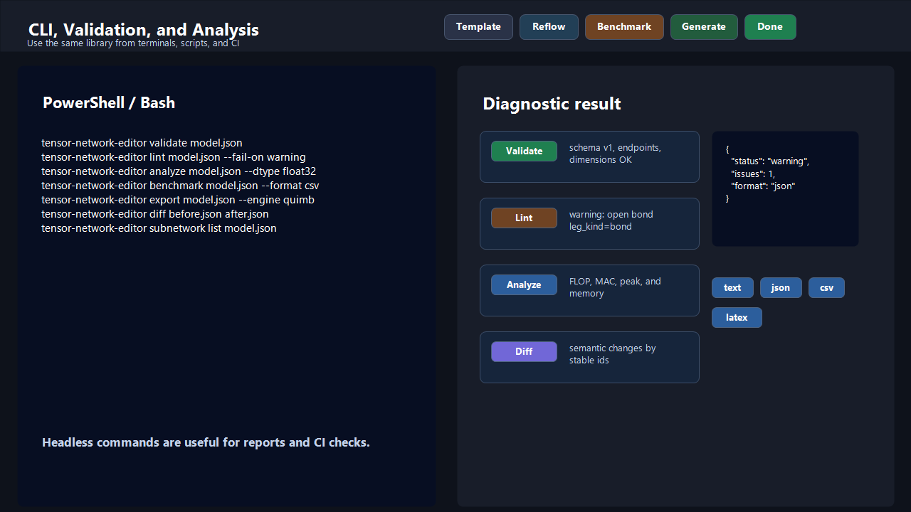

# CLI

This page covers the `tensor-network-editor` command. The CLI can launch the
visual editor or run headless commands for validation, linting, analysis, code
generation, benchmark comparisons, diagnostics, diffs, templates, and
reusable-subnetwork catalogs.

## Contents

- [Launch the Editor](#launch-the-editor)
- [Debug Logging](#debug-logging)
- [Headless Commands](#headless-commands)
- [Validate](#validate)
- [Lint](#lint)
- [Analyze](#analyze)
- [Benchmark](#benchmark)
- [Doctor](#doctor)
- [Export](#export)
- [Render](#render)
- [Canonicalize](#canonicalize)
- [Diff](#diff)
- [Template Commands](#template-commands)
- [Subnetwork Commands](#subnetwork-commands)
- [JSON Output](#json-output)
- [Exit Codes](#exit-codes)

## Launch the Editor

Start the local editor:

```bash
tensor-network-editor edit
```

The `edit` subcommand launches the visual editor.
The command keeps the local server running until you confirm with `Done` or
stop the session with `Cancel`.

Useful options:

```bash
tensor-network-editor edit --load my_network.json
tensor-network-editor edit --engine quimb
tensor-network-editor edit --theme light
tensor-network-editor edit --ui pywebview
tensor-network-editor edit --ui server
tensor-network-editor edit --save-code generated_network.py
tensor-network-editor edit --print-code
tensor-network-editor edit --no-browser
```

You can combine them:

```bash
tensor-network-editor edit --load my_network.json --engine quimb --save-code generated_network.py
```

By default, `edit` opens the local URL in your browser.

Use `--ui pywebview` when you want the same local editor inside a native
desktop window and you have installed the optional desktop extra:

```bash
python -m pip install "tensor-network-editor[desktop]"
tensor-network-editor edit --ui pywebview
```

Use `--ui server` when you want to start the local server but open the printed
URL manually. `--no-browser` remains as a compatibility alias for the same
server-only mode.

Use `--theme` to choose the editor colors at startup. Available themes are
`dark`, `light`, `contrast`, `colorblind`, and `shiny`; `dark` is the default.

## Debug Logging

The CLI stays quiet by default. When you need more context for debugging, turn
package logs on explicitly:

```bash
tensor-network-editor --log-level info edit --no-browser
tensor-network-editor --log-level debug validate my_network.json
```

If you want a persistent trace on disk, add `--log-file`:

```bash
tensor-network-editor --log-file tne.log validate my_network.json
tensor-network-editor --log-level info --log-file tne.log template list
tensor-network-editor --log-level debug --log-file tne-editor.log edit --no-browser
tensor-network-editor --log-file tne.log --log-max-bytes 10485760 --log-backup-count 5 edit --no-browser
```

When `--log-file` is provided without `--log-level`, the file capture defaults
to `debug` while standard error stays quiet. This is useful when you want a
full trace without filling the terminal.

Persistent log files now rotate by size automatically. If you do not pass
rotation flags, the defaults are:

- `--log-max-bytes 10485760`
- `--log-backup-count 5`

That keeps one active file plus up to five rotated backups such as
`tne.log.1`, `tne.log.2`, and so on.

You can also use the environment variable fallback:

PowerShell:

```powershell
$env:TNE_LOG_LEVEL = "debug"
tensor-network-editor template list
Remove-Item Env:\TNE_LOG_LEVEL
```

Bash:

```bash
TNE_LOG_LEVEL=debug tensor-network-editor template list
```

The CLI flag takes priority over `TNE_LOG_LEVEL`. When logging is enabled, the
package prints a short runtime diagnostic summary with the active Python
executable, current working directory, imported package path, version, and any
editable-install root that may point to a different checkout or worktree.

In `debug`, the package now logs a fuller but more compact story instead of
only the runtime summary. Typical entries include:

- CLI command start and finish with `command=...`, `outcome=...`, and
  `elapsed_ms=...`
- effective Python import settings such as `python_import_mode=...` and
  `source_profile=...`
- important decisions such as periodic normalization, hyperedge lowering, or
  live-import fallback to the static parser
- editor request lifecycle events with `session=...`, `route=...`, and timing
- editor backend persistence flows such as draft load/save/clear, template
  promotion, reusable subnetwork saves, session launch/cancel, and static
  asset-cache refreshes
- planner and benchmark semantics such as `refresh_reason=...`,
  `cache_state=...`, `analysis_status=...`, `analysis_source=...`,
  `benchmark_position=...`, `scheme_count=...`, and `export_format=...`
- browser-editor console traces for API requests and key frontend flows such as
  bootstrap, draft recovery, code generation, planner refreshes, benchmark
  navigation, comparison exports, template actions, and reusable-subnetwork
  actions when you open the browser devtools console

The intent is one readable story per operation: high-level steps keep their
`... started` / `... finished` lifecycle, important branch decisions stay
visible, and routine low-level success breadcrumbs are folded into the
`... finished` line instead of being printed separately.

At `info`, the package still reports meaningful milestones such as runtime
diagnostics and session start/stop, but it now avoids routine successful
internal file reads and writes that usually add noise without helping diagnosis.

Example debug flow:

```text
DEBUG tensor_network_editor.cli: CLI command started command=validate path=my_network.json
DEBUG tensor_network_editor: Runtime diagnostics: python=... cwd=... package=... version=...
DEBUG tensor_network_editor.internal.io._serialization: Serialized spec load finished path=my_network.json edge_count=11 mode=normal tensor_count=12 outcome=success elapsed_ms=1
DEBUG tensor_network_editor.internal.validation._validation_spec: Spec validation finished tensor_count=12 edge_count=11 mode=normal outcome=success elapsed_ms=4
DEBUG tensor_network_editor.cli: CLI command finished command=validate path=my_network.json outcome=success elapsed_ms=12
```

When you launch `edit` with `--log-level debug`, the browser console now also
shows correlated frontend traces under the same session, for example:

```text
API request started session=3b7f4d2a operation=bootstrap method=GET route=/api/bootstrap request_id=req-1
Bootstrap finished session=3b7f4d2a operation=bootstrap engine=quimb collection_format=list restored_draft=false outcome=success elapsed_ms=18
Generate code finished session=3b7f4d2a operation=generate engine=quimb outcome=generated elapsed_ms=11
```

If the editor is launched with `--log-file`, those frontend traces are also
forwarded back to the local Python server and appended to the same log file.
That gives you one chronological capture containing:

- CLI startup and runtime diagnostics
- editor backend lifecycle and route traces
- browser API requests and key editor flows
- session completion or cancellation

Two especially useful capture patterns are:

```bash
tensor-network-editor --log-level debug --log-file planner.log benchmark my_network.json
tensor-network-editor --log-file editor.log edit --no-browser
```

From Python, the equivalent persistent capture is:

```python
from tensor_network_editor.editor import EditorLaunchOptions, open_editor


open_editor(
    options=EditorLaunchOptions(
        ui_mode="server",
        log_file_path="tne-editor.log",
        log_file_max_bytes=10_485_760,
        log_file_backup_count=5,
    )
)
```

Python import flags are also global and must appear before the subcommand:

```bash
tensor-network-editor --python-import-mode live validate runtime_network.py
tensor-network-editor --python-reconstruction-level simple validate external_network.py
tensor-network-editor --python-import-mode live --python-object network edit --load runtime_network.py
```

The reconstruction flag controls how much editor metadata the Python importer
tries to rebuild:

- `--python-reconstruction-level auto`: choose the best supported level for the
  detected profile
- `--python-reconstruction-level simple`: portable tensors plus inferred
  connections only
- `--python-reconstruction-level best_available`: currently only supported for
  the package's own `generated` Python exports

If `--python-import-mode live` is used on generated source and the live import
fails because the backend package is missing, the loader falls back to the
static generated-source parser and reports the fallback as a warning.

## Headless Commands

Headless commands work without opening the visual editor:

```bash
tensor-network-editor validate my_network.json
tensor-network-editor lint my_network.json
tensor-network-editor analyze my_network.json
tensor-network-editor benchmark my_network.json
tensor-network-editor doctor my_network.json
tensor-network-editor export my_network.json --engine quimb --output generated_network.py
tensor-network-editor render my_network.json --format svg --output figure.svg
tensor-network-editor render my_network.json --format tikz --output figure.tex
tensor-network-editor render my_network.json --format dot --output graph.dot
tensor-network-editor render my_network.json --format png --output figure.png
tensor-network-editor render my_network.json --format pdf --output figure.pdf
tensor-network-editor canonicalize my_network.json
tensor-network-editor diff before.json after.json
tensor-network-editor template list
tensor-network-editor template build mps --graph-size 6 --bond-dimension 4 --physical-dimension 2
tensor-network-editor subnetwork list my_network.json
tensor-network-editor subnetwork save my_network.json --tensor-ids tensor_a tensor_b --name local_pair --tags reusable boundary
```

These are useful for scripts, quick checks, and CI.

<p align="center">
  
</p>

## Validate

Validate a saved JSON design or a supported Python import profile:

```bash
tensor-network-editor validate my_network.json
```

Validation checks hard consistency rules such as missing endpoints, duplicated
ids, invalid dimensions, and schema problems.

For Python files, the default mode is the conservative static parser. When you
want to execute the source and import a live `quimb` or `tensornetwork`
object instead, use:

```bash
tensor-network-editor --python-import-mode live validate runtime_network.py
tensor-network-editor --python-import-mode live --python-object network validate runtime_network.py
tensor-network-editor --python-reconstruction-level simple validate runtime_network.py
```

JSON output:

```bash
tensor-network-editor validate my_network.json --format json
```

## Lint

Run softer diagnostics:

```bash
tensor-network-editor lint my_network.json
```

Useful options:

```bash
tensor-network-editor lint my_network.json --max-tensor-rank 8
tensor-network-editor lint my_network.json --max-tensor-cardinality 50000
tensor-network-editor lint my_network.json --fail-on warning
```

Linting reports things that may be suspicious even if the spec is valid:

- disconnected components
- suspicious open indices
- very large tensor shapes
- empty groups
- uninformative names
- incomplete manual plans
- guided metadata conflicts such as open `bond` legs, observable annotations on
  connected bonds, and mismatched `symmetry` metadata

For `.py` inputs, the CLI autodetects the same supported Python import
profiles as the library API: generated exports plus conservative static AST
imports for simple `quimb`, `tensornetwork`, and `einsum` / `opt_einsum`
sources. You can switch to subprocess execution for live `quimb` or
`tensornetwork` objects with the same global `--python-import-mode live`
option shown above. The global `--python-reconstruction-level` flag uses
`auto` by default, which resolves to `best_available` for `generated` exports
and to `simple` for external static or live imports.

## Analyze

Analyze structure and contraction metadata:

```bash
tensor-network-editor analyze my_network.json
```

Choose the dtype used for memory estimates:

```bash
tensor-network-editor analyze my_network.json --dtype float32
```

Supported dtypes:

- `float16`
- `float32`
- `float64`
- `complex64`
- `complex128`

Analysis can include manual, automatic full, automatic future, and automatic
past contraction summaries when the design supports those comparisons.

## Benchmark

Benchmark one saved design and compare the stable variants:

```bash
tensor-network-editor benchmark my_network.json
```

The benchmark command compares these rows when they are available:

- `Manual`
- `Auto full`
- `Auto future`
- `Auto past`

Useful options:

```bash
tensor-network-editor benchmark my_network.json --dtype float32
tensor-network-editor benchmark my_network.json --format json
tensor-network-editor benchmark my_network.json --format csv --output benchmark.csv
tensor-network-editor benchmark my_network.json --format latex --output benchmark.tex
```

When you need to diagnose why a planner or benchmark result changed, rerun the
command with logging enabled:

```bash
tensor-network-editor --log-level debug benchmark my_network.json
tensor-network-editor --log-level debug --log-file planner.log benchmark my_network.json --format json
tensor-network-editor --log-file planner.log --log-max-bytes 10485760 --log-backup-count 5 benchmark my_network.json
```

In that mode, benchmark logs now tell a fuller story about:

- whether the effective analysis spec stayed `normal`, used the active periodic
  representative cell, or lowered hyperedges internally
- whether the manual row is complete plus how many manual steps were analyzed
- which automatic variants are available or degraded
- the final `analysis_status`, `warning_count`, `scheme_count`, and chosen
  `export_format`

The table always uses the same columns:

- `Name`
- `FLOP`
- `MAC`
- `Peak`
- `Peak Memory`

When the `planner` extra is not installed in the active `.venv`, the manual row
still works and the automatic rows are marked unavailable. Text, CSV, and LaTeX
show `-` for those metrics, while JSON preserves each row `status` and
`message`.

Rows whose analysis is incomplete can still show the partial metrics available
in their summary. Treat the row `status` as the source of truth when a script
needs to distinguish complete and incomplete comparisons.

For periodic specs, benchmark uses the same active-cell normalization as
`analyze`, so it operates on the active linear/grid/tree representative cell.
For normal-mode specs with hyperedges, benchmark lowers those hyperedges to
internal generated copy tensors, prints a warning, and leaves the saved visual
model unchanged.

## Doctor

Run one friendly diagnostic command when you are not sure whether to validate,
lint, analyze, or check installed extras:

```bash
tensor-network-editor doctor my_network.json
tensor-network-editor doctor my_network.json --dtype float32
tensor-network-editor doctor my_network.json --format json
```

`doctor` reports:

- validation status
- lint status
- analysis and benchmark summaries when validation passes
- available backends/extras such as `numpy`, `torch`, `opt_einsum`, and `matplotlib`
- warnings and suggestions, including suspicious model structure, backend
  recommendations, incomplete manual plans, and clearly cheaper automatic
  alternatives

Exit code is `0` when the file loads and validation passes, `1` when validation
finds errors, and `2` for load/parse errors.

## Export

Generate backend Python code without opening the editor:

```bash
tensor-network-editor export my_network.json --engine quimb --output generated_network.py
```

Choose a tensor collection format:

```bash
tensor-network-editor export my_network.json --engine einsum_numpy --collection-format dict
```

Supported engines:

- `tensorkrowch`
- `einsum_torch`
- `einsum_numpy`
- `quimb`
- `tensornetwork`

Supported collection formats:

- `list`
- `matrix`
- `dict`

If `--output` is omitted, generated code is printed to standard output.

Relative external tensor-data paths stored in the JSON are resolved relative to
the input spec path before they are emitted into generated code.

## Render

Render a saved design to a static image or academic text format without opening
the browser editor:

```bash
tensor-network-editor render my_network.json --format svg --output figure.svg
tensor-network-editor render my_network.json --format tikz --output figure.tex
tensor-network-editor render my_network.json --format dot --output graph.dot
tensor-network-editor render my_network.json --format png --output figure.png
tensor-network-editor render my_network.json --format pdf --output figure.pdf
```

If `--output` is omitted, SVG, TikZ, and DOT are printed to standard output:

```bash
tensor-network-editor render my_network.json --format svg
tensor-network-editor render my_network.json --format tikz
tensor-network-editor render my_network.json --format dot
```

SVG, PNG, and PDF rendering use the saved canvas positions through the same
Matplotlib-backed academic renderer. TikZ output is a `tikzpicture`, not a
complete LaTeX document; DOT output is a Graphviz `graph`. Binary outputs must
be written to a file. All formats draw tensors and connections, with groups,
notes, open indices, and hyperedges included where the target format supports
them.

## Canonicalize

Canonicalize a spec for cleaner Git history and stable JSON ordering:

```bash
tensor-network-editor canonicalize my_network.json
```

Write the canonicalized JSON to a file:

```bash
tensor-network-editor canonicalize my_network.json --output my_network.canonical.json
```

Rewrite ids deterministically in canonical order:

```bash
tensor-network-editor canonicalize my_network.json --deterministic-ids
```

Canonicalization preserves semantics, keeps existing ids by default, preserves
manual contraction step order, normalizes `metadata.tags`, and sorts the main
graph entities deterministically.

## Diff

Compare two specs by stable entity ids:

```bash
tensor-network-editor diff before.json after.json
```

JSON output is often easiest to consume:

```bash
tensor-network-editor diff before.json after.json --format json
```

Request the richer semantic diff:

```bash
tensor-network-editor diff before.json after.json --semantic
tensor-network-editor diff before.json after.json --semantic --format json
```

The basic diff groups changes by tensor, edge, group, note, and plan. The
semantic diff reports field-level tensor, index, edge, group, note, plan, and
step changes, plus step reordering and opaque `linear_periodic_chain` changes.

When either input is a `.py` file, `diff` uses the same global Python import
mode and reconstruction level for both files. Mixed static/live or
mixed simple/best-available settings per file are not supported in one `diff`
command.

## Template Commands

List built-in templates:

```bash
tensor-network-editor template list
```

Build a template:

```bash
tensor-network-editor template build mps --graph-size 6 --bond-dimension 4 --physical-dimension 2 --output mps.json
```

Print the built template JSON instead of writing a file:

```bash
tensor-network-editor template build peps_2x2 --graph-size 3
```

`template build` accepts the same `--format` option shape as other template
commands, but the built spec itself is serialized as JSON when `--output` is
omitted.

Built-in templates include MPS (`mps`), MPO (`mpo`), PEPS (`peps_2x2`), MERA
(`mera`), TTN (`ttn`), PEPO (`pepo`), and TEBD Gate Layer
(`tebd_gate_layer`). The `mps` template also accepts
`--boundary-condition`, `--symmetry`, and `--initial-state`. The `mpo`
template accepts `--boundary-condition`, `--j`, and `--h`. The `ttn`
template accepts `--depth`, `--leaf-physical-legs` /
`--no-leaf-physical-legs`, `--root-open-leg` / `--no-root-open-leg`, and
`--isometric` / `--no-isometric`.
When `--output` is omitted, `template build` prints the serialized spec JSON to
standard output.

## Subnetwork Commands

Reusable subnetworks live in the project catalog resolved from the spec path:
`.tensor-network-editor/subnetworks.json` next to the saved design. Some
commands can also merge an explicit shared catalog path.

List the reusable subnetworks available for one project:

```bash
tensor-network-editor subnetwork list my_network.json
```

Include a shared catalog in the merged view:

```bash
tensor-network-editor subnetwork list my_network.json --shared-catalog-path /path/to/shared-subnetworks.json
```

Save selected tensors from one spec into the project catalog:

```bash
tensor-network-editor subnetwork save my_network.json --tensor-ids tensor_a tensor_b --name local_pair --tags reusable boundary
```

Overwrite an existing project entry with the same name:

```bash
tensor-network-editor subnetwork save my_network.json --tensor-ids tensor_a tensor_b --name local_pair --overwrite
```

Export one reusable subnetwork back to a normal spec file:

```bash
tensor-network-editor subnetwork export my_network.json local_pair --output local_pair.json
```

Useful details:

- `subnetwork save` always writes to the project catalog next to the design
- `subnetwork list` and `subnetwork export` can merge a shared catalog through
  `--shared-catalog-path`
- when project and shared catalogs contain the same subnetwork name, the
  project entry is used
- `subnetwork list --format json` includes merged definitions and catalog
  warnings

## JSON Output

These commands support `--format json`:

- `validate`
- `lint`
- `analyze`
- `benchmark`
- `doctor`
- `diff`
- `subnetwork list`
- `template list`

`template build` emits the built spec JSON when you omit `--output`.
`canonicalize` already emits canonical JSON when you omit `--output`.
Use JSON output when another script should consume the result.

## Exit Codes

Common exit codes:

- `0`: command completed successfully
- `1`: validation failed, `doctor` found validation errors, or lint found
  warnings with `--fail-on warning`
- `2`: expected package error such as code generation, serialization, IO, or
  invalid option value
- `130`: interrupted with Ctrl+C
