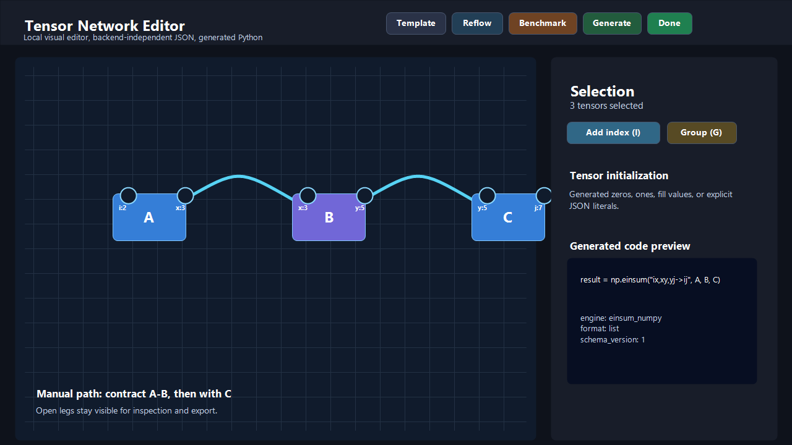
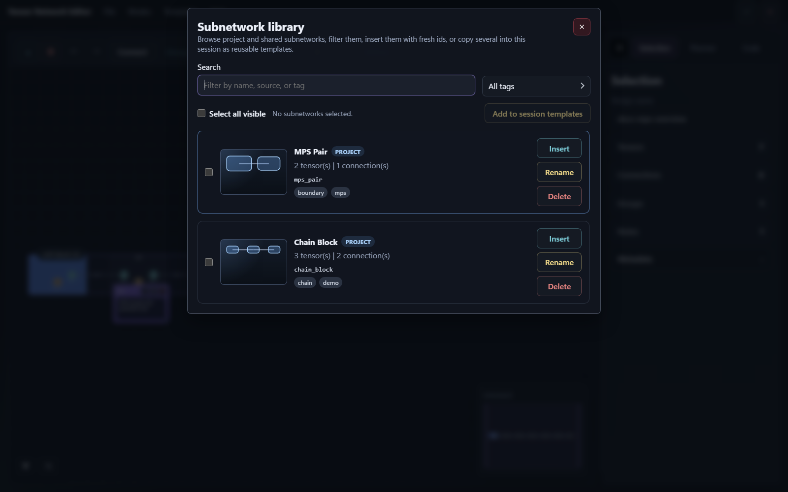
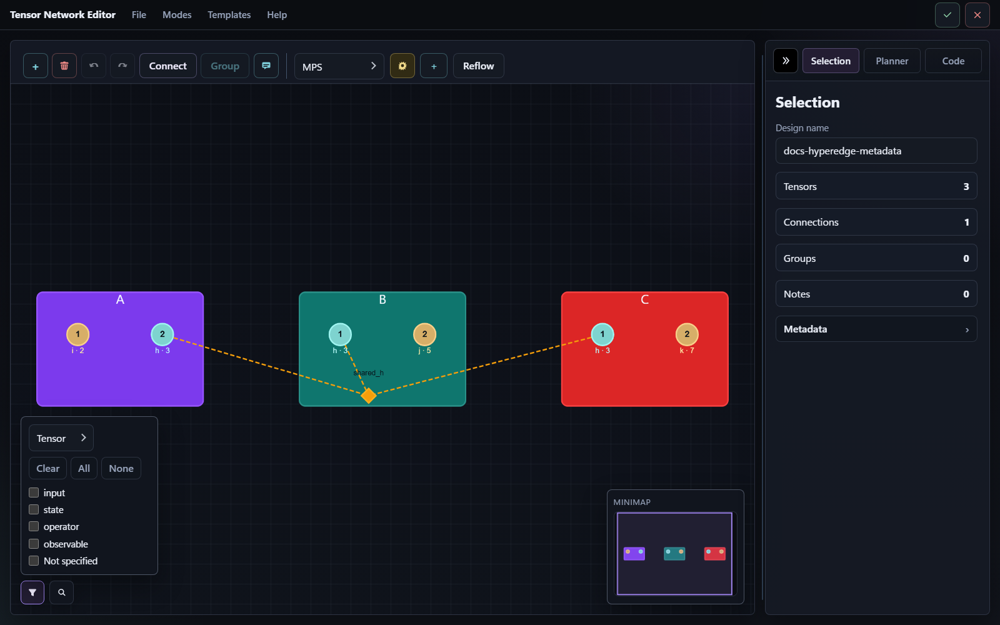
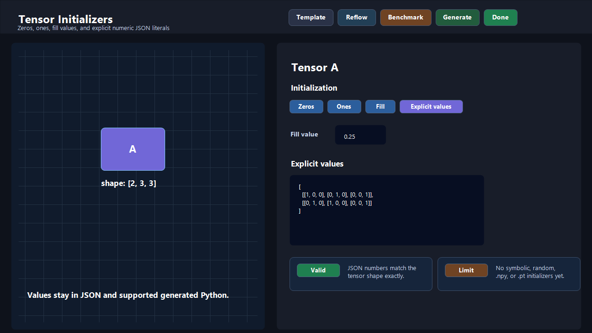
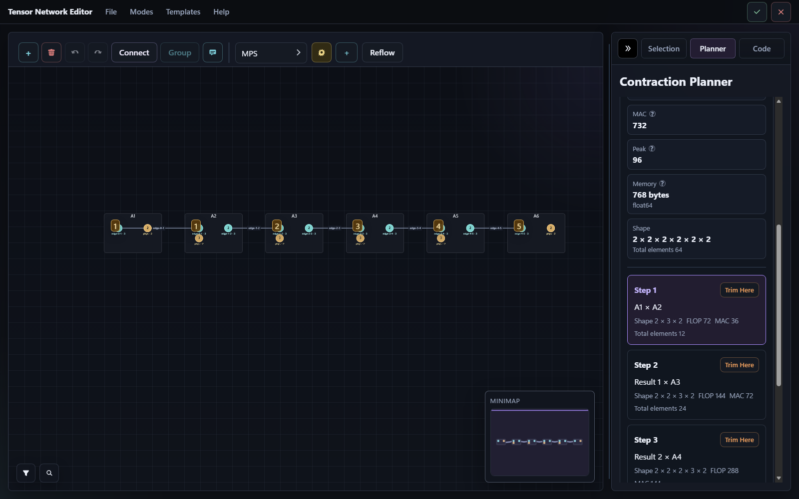
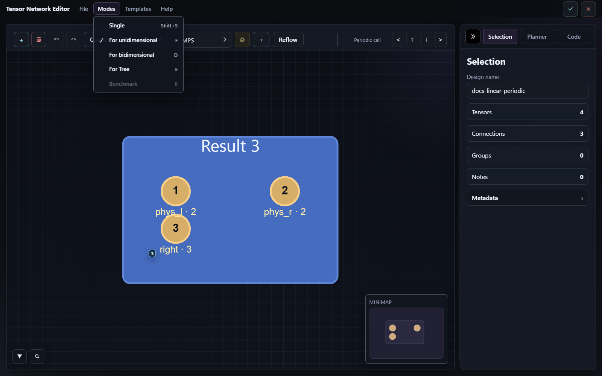

# User Guide

This guide explains how to use `tensor-network-editor` comfortably after the
first launch. It focuses on practical workflow, choices, examples, and current
limits.

For a longer manual with deeper CLI recipes, Python recipes, export workflows,
periodic-mode details, and decision guidance, see
[extended_guide.md](extended_guide.md).

## Contents

- [Core Idea](#core-idea)
- [Normal Editor Workflow](#normal-editor-workflow)
- [Keyboard Shortcuts](#keyboard-shortcuts)
- [Choosing a Backend](#choosing-a-backend)
- [Choosing a Collection Format](#choosing-a-collection-format)
- [Choosing a Theme](#choosing-a-theme)
- [Templates](#templates)
- [Subnetwork Library](#subnetwork-library)
- [Layout Tools](#layout-tools)
- [Metadata and Filters](#metadata-and-filters)
- [Saving and Loading](#saving-and-loading)
- [Hyperedges](#hyperedges)
- [Manual Contraction Plans](#manual-contraction-plans)
- [Planner Extra](#planner-extra)
- [Benchmark Mode](#benchmark-mode)
- [Periodic Modes](#periodic-modes)
- [Useful Tips](#useful-tips)
- [Current Limits](#current-limits)

## Core Idea

The package separates two artifacts:

- the abstract tensor-network design, stored as a `NetworkSpec`
- generated Python code for one target backend

That separation is important. You can keep one JSON design, reopen it later,
and generate code for another backend without redrawing the network.

It helps to think in these objects:

- a tensor is a node on the canvas
- an index belongs to one tensor and has a dimension
- an edge connects two indices with matching dimensions
- a hyperedge connects three or more indices that share one logical bond
- a group organizes several tensors visually
- a note stores text on the canvas
- a contraction plan stores a manual contraction order

## Normal Editor Workflow

A typical session looks like this:

1. Launch the editor with a default backend.
2. Create tensors and indices.
3. Connect matching indices.
4. Optionally select three or more compatible open indices and create a
   hyperedge with `H`, the `Selection` action, or the multi-index right-click
   menu.
5. Add groups or notes when the network becomes hard to read.
6. Optionally inspect or edit the contraction plan.
7. Confirm the session with `Done`.
8. Save the JSON design and, when useful, generated Python code.

The editor is local. Closing the browser tab does not upload data anywhere.

<p align="center">
  
</p>

## Keyboard Shortcuts

The editor shows shortcut-aware hover tooltips for common actions. The most
useful shortcuts are:

| Shortcut | Action |
| --- | --- |
| `N` | Add a tensor |
| `I` | Add one index to each selected editable tensor |
| `H` | Create a hyperedge from selected compatible open indices |
| `G` | Group the selected tensors |
| `R` | Open the Reflow popover |
| `Shift+E` | Save the selected subnetwork as JSON |
| `Alt+ArrowLeft` / `Alt+ArrowRight` | Move to the previous or next cell/item |
| `Alt+ArrowUp` / `Alt+ArrowDown` | Move vertically in grid periodic mode |
| `Ctrl/Cmd+S` | Save the current design |
| `Ctrl/Cmd+L` | Load a design file |
| `Ctrl/Cmd+Enter` | Finish the editor session |

Text fields keep normal typing behavior. For example, native text copy in side
panels still works even though `Ctrl/Cmd+C` can copy a selected tensor
subgraph from the drawing area.

## Choosing a Backend

Supported engine names are:

- `tensorkrowch`
- `einsum_torch`
- `einsum_numpy`
- `quimb`
- `tensornetwork`

Simple rule of thumb:

- choose `einsum_numpy` for lightweight generated NumPy code
- choose `einsum_torch` for a PyTorch-style workflow
- choose `quimb`, `tensornetwork`, or `tensorkrowch` when you already use that
  ecosystem

The editor starts with `TensorKrowch` selected unless you pass another default
engine from the CLI or Python API.

Backend extras only help you run generated code in the same environment. The
editor can still generate source text without those backend libraries installed.
See [installation.md](installation.md#optional-extras).

## Choosing a Collection Format

Generated code can organize created tensors in three layouts:

- `list`
- `matrix`
- `dict`

This only changes how generated Python stores the tensor variables. It does not
change the abstract network stored in JSON.

Use:

- `list` for a simple ordered container
- `matrix` when the visual row layout matters
- `dict` when stable names are more convenient than positions

From Python, pass `TensorCollectionFormat.LIST`,
`TensorCollectionFormat.MATRIX`, or `TensorCollectionFormat.DICT` to
`generate_code(...)` or `open_editor(...)`.

## Choosing a Theme

The editor starts in the `dark` theme by default. If another palette is more
comfortable for your display or vision, choose it when launching the session.

CLI:

```bash
tensor-network-editor edit --theme colorblind
```

Python:

```python
from tensor_network_editor.editor import EditorLaunchOptions, open_editor

open_editor(options=EditorLaunchOptions(theme="contrast"))
```

Available themes are `dark`, `light`, `contrast`, `colorblind`, and `shiny`.
The choice only affects the browser editor appearance; saved network JSON and
recoverable drafts keep the same model data.

## Templates

Templates help you start from common tensor-network shapes instead of placing
each tensor by hand.

Built-in templates:

- `MPS`
- `MPO`
- `PEPS`
- `MERA`
- `TTN`
- `PEPO`
- `TEBD Gate Layer`

Template controls include:

- graph size
- bond dimension
- physical dimension
- `MPS` also exposes boundary, symmetry, and initialization presets
- `MPO` also exposes boundary condition plus `J` and `h`
- `TTN` also exposes depth, leaf legs, root open leg, and isometric toggles

The graph-size label depends on the selected template:

- `MPS`, `MPO`, and `TEBD Gate Layer` use `Sites`
- `PEPS` and `PEPO` use `Side length`
- `MERA` and `TTN` use `Depth`

You can also build templates from Python or the CLI. See [api.md](api.md) and
[cli.md](cli.md#template-commands).

## Subnetwork Library

The subnetwork library is for reusable building blocks that are smaller than a
full template. It keeps the same extraction and insertion behavior used inside
the editor, but wraps that workflow in a persistent catalog.

Useful ideas:

- `Save to library` stores the current tensor selection as a reusable
  subnetwork
- `Shift+E` or the `Templates` dropdown can save the current tensor selection
  as a standalone subnetwork JSON file
- the default project catalog lives next to your design at
  `.tensor-network-editor/subnetworks.json`
- a session can also point to an optional shared catalog, merged at runtime
  with the project catalog
- project entries win on name conflicts, and the editor warns when they shadow
  a shared entry
- each entry keeps a stable name, a display name, optional tags, and the saved
  subnetwork spec
- the library dialog lets you browse, search, filter by tag, inspect a small
  generated preview, and insert the saved block back into the canvas
- inserted subnetworks always receive fresh ids, so you can reuse the same
  block many times safely

This is especially useful when you repeat boundary gadgets, local motifs, or
hand-tuned fragments across several designs.

<p align="center">
  
</p>

## Layout Tools

The `Reflow` popover groups the layout actions that help clean up a network
after imports, large edits, or repeated insertions.

Useful ideas:

- `Auto layout` chooses a layout for the current tensor selection
- when nothing is selected, `Auto layout` arranges the whole graph instead
- chain- and tree-like structures still use those specialized layouts
- irregular or cyclic structures use a layered placement with overlap-safe
  spacing instead of falling back immediately to a coarse grid
- the other manual actions remain available for explicit control: `Chain`,
  `Tree`, `Grid`, and `Snap to Grid`

When the active editor mode already disables reflow tools, `Auto layout`
follows the same rule instead of bypassing those restrictions.

## Metadata and Filters

The editor now exposes metadata in three layers instead of leaving everything
inside raw JSON:

- `Tags` writes `metadata.tags`
- `Suggested annotations` writes a small guided set of tensor or index keys
- `Custom metadata (JSON)` keeps the rest of your free-form metadata

The guided keys are:

- tensor: `role`, `state`, `provenance`, `symmetry`
- index: `leg_kind`, `symmetry`, `observable`

These are still plain text annotations, not locked enums. The editor offers
suggestions to get you started, but you can type any value that fits your
workflow. Clearing a guided field removes that key.

The JSON editor remains available for everything else. To avoid duplicate
editing surfaces, it hides the guided keys and `metadata.tags` while those
dedicated controls are present.

The Selection tab also includes `Metadata filters`. They are meant for visual
inspection, not structural edits:

- choose `Tensor` or `Index` scope
- filter by tag
- optionally filter by one guided key plus value
- use `Clear` to return to the normal view

Filters only change emphasis on the canvas and the minimap. They do not hide
elements, change the current selection, modify saved metadata, or enter
undo/redo history. The filter state is local to the current session.

When several indices are selected, the Selection sidebar and the compact
multi-index right-click menu expose one shared `Dimension` field. Updating it
changes all selected editable indices at once and also synchronizes connected
partner dimensions where the normal editor rules allow it.

<p align="center">
  
</p>

## Saving and Loading

The JSON design is the durable part of your work. Generated code is a useful
implementation artifact, but the JSON remains backend-independent.

Practical rule:

- save JSON if you want to reopen, version, compare, or regenerate the network
- save generated Python if you want to run or adapt a concrete backend script
- keep both when you want reproducibility and immediately runnable code

The browser editor also keeps one recoverable local draft per project checkout
under `.tensor-network-editor/drafts/`. If a previous session is found when the
editor starts, it asks whether you want to restore it. The draft is cleared
after an explicit JSON save, `Done`, `Cancel`, or starting a fresh design, but
it is kept if the tab is simply closed.

Saved files use a schema wrapper:

```json
{
  "schema_version": 2,
  "network": {
    "...": "..."
  }
}
```

The package validates saved designs when loading or saving. New saves use
schema version `2`, while schema version `1` files are still accepted for
older saved designs.
Historical compatibility-only schema numbers are no longer accepted on load.

For Python source imports, the static parser is the safest default. If you ask
for live import and a generated source file cannot import its backend package
from the active `.venv`, the loader falls back to the static parser and reports
that fallback as a warning.

## Tensor Values

The tensor sidebar can store portable tensor initializers directly in the
design instead of treating every tensor as an implicit backend-side zero array.

Available modes:

- `Generated zeros`: generated backend code initializes the tensor with zeros
- `Ones`: generated backend code uses a backend-native `ones(...)`
  initializer
- `Fill value`: one scalar is repeated across the whole tensor shape
- `Identity / delta`: a square rank-2 tensor initialized with a diagonal
- `Copy tensor`: a generalized diagonal tensor with equal index dimensions
- `Random`: seeded normal or uniform values, with seed `0` as the default
- `Explicit values`: you provide JSON values that exactly match the tensor
  shape
- `External .npy/.npz/.pt`: generated code loads values from a file and checks
  the loaded shape

Useful rules:

- each initializer can use a portable dtype: `float32`, `float64`,
  `complex64`, or `complex128`
- complex scalars are stored as `{"real": x, "imag": y}` in JSON, while the
  sidebar accepts friendlier values such as `1+2j`
- explicit values must be valid JSON and must match the tensor shape exactly
- invalid JSON or ragged lists are rejected before they overwrite the saved
  design
- `.npy` files use the whole stored array
- `.npz` files need an `Array key`
- `.pt` files may store a tensor directly, or use `Array/key` to select a
  tensor from a saved mapping
- when you export from the CLI, relative external file paths are interpreted
  relative to the JSON design file
- saved JSON round-trips these initializer modes, and generated Python emits
  backend-native constructors for them
- symbolic expressions are still out of scope for the editor

<p align="center">
  
</p>

## Hyperedges

Hyperedges let one logical connection fan out across three or more indices
without drawing auxiliary copy tensors by hand in the editor.

Useful rules:

- hyperedges are available only in normal mode
- select three or more open indices with the same dimension, then create the
  hyperedge with `H`, the compact `Create hyperedge` action in `Selection`, or
  the multi-index right-click menu on one of those selected indices
- the selection may also include the tensors that own those selected indices;
  the editor still uses the selected open indices as the hyperedge endpoints
- every endpoint must be an open index, and all endpoints must share the same
  dimension
- the editor renders hyperedges as a visible hub plus spokes; that hub is a
  virtual UI node, not a saved tensor
- you can drag the hub to improve the drawing; the saved
  `HyperedgeSpec.hub_offset` keeps that displacement relative to the automatic
  center, so later tensor or index moves preserve the manual adjustment
- older JSON payloads that do not include `hub_offset` still load with a zero
  offset
- generated backend code lowers each hyperedge into one autogenerated copy
  tensor plus ordinary binary edges
- generated copy tensors use compact zeros-plus-diagonal-fill source instead
  of writing giant nested literals
- supported generated Python round-trips reconstruct the original hyperedge
  from structured copy-tensor markers

## Manual Contraction Plans

Manual contraction plans are stored with `ContractionPlanSpec` and
`ContractionStepSpec`.

In practice:

- a plan is a named list of contraction steps
- each step consumes two operands and creates a new intermediate operand
- consumed operands cannot be reused by later steps
- a complete plan ends with one final result
- a partial plan leaves surviving operands in `remaining_operands`

When `generate_code(...)` sees a saved manual plan, generated code follows that
plan instead of using the backend's usual one-shot export.

Backend notes:

- `tensornetwork` and `quimb` can export step-by-step manual plans, including
  outer products
- `einsum_numpy` and `einsum_torch` export one `einsum(...)` call per manual
  step
- `tensorkrowch` exports normal manual contractions, but rejects manual
  outer-product steps with `CodeGenerationError`

Manual plans may also store contraction-scene snapshots. Those snapshots keep
UI layout state for operands and survive JSON round trips.

In periodic modes, virtual boundary cells are also planner operands. Linear
mode uses `Previous cell` and `Next cell`; grid mode uses the four neighboring
cell borders; tree mode uses the parent border and one child border per branch.
Leaving one of those operands alive is how you intentionally export a partial
network such as an MPS-like frontier.

## Planner Extra

The optional `planner` extra installs `opt_einsum` and enables automatic greedy
contraction suggestions.

```bash
python -m pip install "tensor-network-editor[planner]"
```

The planner can compare manual and automatic paths using metrics such as:

- operation cost
- peak intermediate size
- estimated peak bytes for the selected dtype
- the step where the peak appears

The package still works without the `planner` extra. You only lose automatic
suggestions.

<p align="center">
  
</p>

## Benchmark Mode

Benchmark mode is the editor workflow for comparing several contraction schemes
on the same network without permanently changing the saved manual path until
you leave the benchmark session.

Useful ideas:

- `Benchmark` starts from the current tensor network view and lets you move
  through saved comparison schemes
- `Compare` opens a summary table with `Name`, `FLOP`, `MAC`, `Peak`, and
  `Peak Memory`
- incomplete schemes can still show partial metric summaries when analysis has
  enough information, but best/worst highlighting is reserved for complete
  comparable schemes
- scheme names preserve the spaces you type while editing them in the toolbar
- the compare dialog can export the current table as `CSV` or `TXT`, and can
  copy a `LaTeX` table for papers or notes
- the CLI mirrors this workflow with
  `tensor-network-editor benchmark my_network.json`
- `--format csv`, `--format latex`, and `--output ...` are useful when you
  want reproducible tables outside the browser
- benchmark scheme views keep template, subnetwork-library, and reflow actions
  disabled so comparison sessions do not drift into normal editing by mistake
- designs that contain hyperedges are benchmarked by lowering those hyperedges
  to internal generated copy tensors; the editor shows a warning and does not
  change the visual model

If the active `.venv` does not include the `planner` extra, manual benchmark
rows still work and the automatic rows are reported as unavailable.

<p align="center">
  
</p>

## Periodic Modes

Periodic modes are the specialized editor workflows for repeated structures.
They are more constrained than free drawing, but they let you keep a reusable
typed payload instead of treating repetition as a visual convention only.

### Linear periodic (For unidimensional)

Linear periodic mode is for repeated one-dimensional structures with an
initial cell, a periodic cell, and a final cell.

Useful ideas:

- each cell can have its own tensors, edges, notes, groups, and contraction
  plan
- use `Alt+ArrowLeft` and `Alt+ArrowRight` to move between cells/items from the
  keyboard
- For mode can generate code with `tensornetwork`, `quimb`, `tensorkrowch`,
  `einsum_numpy`, and `einsum_torch`
- `Previous cell` and `Next cell` are special carry operands in manual plans
- `Next cell` must be the last contraction step in a carry plan
- generated code forwards the chosen carry operand to the next cell
- `quimb` exports `network_tensors`, `network`, `open_inds`, and `result` when
  the repeated chain finishes in one contracted object
- `einsum_numpy` and `einsum_torch` export `result`, plus
  `remaining_operands` when a carry/manual path leaves extra operands alive
- `tensorkrowch` still rejects manual outer-product steps, including in For
  mode

This mode is more specialized than normal free drawing. Start with the regular
editor workflow unless your network really is a repeated chain.

### Grid periodic (For bidimensional)

Grid periodic mode is for repeated two-dimensional layouts represented by a
nine-cell neighborhood around the active center cell.

Useful ideas:

- the saved payload uses `GridPeriodicGridSpec` with one representative cell
  for each position in the `3x3` neighborhood
- boundary tensors describe how bonds continue toward neighboring cells
- use the four `Alt+Arrow` shortcuts or the toolbar arrows to move around the
  neighborhood
- export works with the bundled backends, so you can keep a reusable 2D design
  instead of flattening it into one large hand-drawn graph
- manual planner mode can use clickable virtual boundary operands: `Upper
  cell`, `Right cell`, `Lower cell`, and `Left cell`
- generated code visits cells in row-major order: it starts at the upper-left
  cell, contracts left-to-right across the row, then carries the partial result
  into the leftmost cell of the next row
- if a manual plan leaves a boundary or intermediate alive, generated code keeps
  the partial network in `remaining_operands` instead of forcing one final
  tensor
- hyperedges are not available inside the periodic-cell editor payloads in this
  first release

This is a good fit for repeated PEPS-style neighborhoods or other local 2D
motifs where center, edge, and corner cells differ.

### Tree periodic (For Tree)

Tree periodic mode is for repeated rooted tree structures with representative
`root`, `branch`, and `leaf` cells plus a configurable branching factor.

Useful ideas:

- the saved payload uses `TreePeriodicTreeSpec`
- the editor keeps one representative cell for the root, one for internal
  branches, and one for leaves
- export works with the bundled backends, so the mode is officially supported
  for modeling, serialization, and code generation
- manual planner mode can use clickable virtual boundary operands: `Parent
  cell` and one `Child N` operand per child branch
- generated tree exports expose the manual-plan partial network with a
  bottom-up pass: leaves contract into their direct parents first, then the
  next level contracts upward until the root is reached
- hyperedges are not available inside the periodic-cell editor payloads in this
  first release

This mode is useful when the repeated structure is genuinely hierarchical and a
linear or grid neighborhood would hide that intent.

## Useful Tips

- Keep tensor and index names meaningful. Generated Python is easier to read.
- Save the JSON design early, not only the generated code.
- Use groups for larger diagrams so visual organization does not depend only on
  tensor positions.
- Save repeated motifs into the subnetwork library instead of copying them by
  hand between files.
- Use notes to store assumptions, boundary choices, or experiment context.
- Try `Auto layout` after importing a design or inserting several reusable
  blocks, then finish with a manual layout action only if you want a specific
  visual style.
- If a backend export fails, try `einsum_numpy` to inspect a simpler generated
  representation.
- Run `tensor-network-editor lint my_network.json` when a network loads but
  looks suspicious.
- Run `tensor-network-editor analyze my_network.json --dtype float32` when
  memory estimates should match your intended element width.
- Run `tensor-network-editor benchmark my_network.json --format csv --output benchmark.csv`
  when you want a stable comparison table for experiments or papers.
- Run `tensor-network-editor doctor my_network.json` when you want one command
  to combine validation, lint, analysis, benchmark, and dependency checks.
- Run `tensor-network-editor render my_network.json --format tikz --output figure.tex`
  or `--format dot --output graph.dot` when you want paper-friendly or
  Graphviz-friendly diagrams from the saved canvas layout. The editor File
  menu can export the current canvas to the same `.tex` and `.dot` formats.

## Current Limits

- Hyperedges are available only in normal mode. Planner and benchmark analyze
  them as internal generated copy tensors, with a warning, while the visual
  model remains unchanged.
- Tensor values support portable built-in initializers, complex scalars, and
  external `.npy` / `.npz` / `.pt` arrays or tensors, but not symbolic
  expressions.
- TenPy code generation is not included.
- Linear, grid, and tree periodic code generation work with every bundled
  backend.
- Manual outer-product steps cannot be exported to `tensorkrowch`.
- In `For bidimensional` and `For Tree`, virtual boundary operands represent
  payload/frontier interfaces. They are useful for partial contractions, but
  they are not physical tensors you edit directly.

For common fixes, see [troubleshooting.md](troubleshooting.md).
